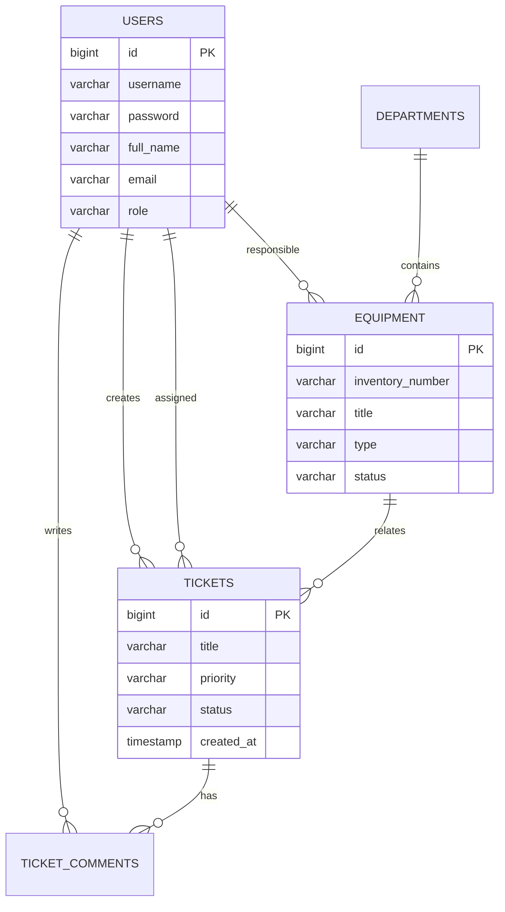

# Схема базы данных

База данных PostgreSQL создается контейнером `postgres`.

## Основные таблицы

### `users`

| Поле | Тип | Описание |
| --- | --- | --- |
| `id` | bigint | Идентификатор пользователя |
| `username` | varchar | Уникальный логин |
| `password` | varchar | BCrypt-хэш пароля |
| `full_name` | varchar | ФИО |
| `email` | varchar | Email |
| `role` | varchar | `ADMIN`, `TECHNICIAN`, `EMPLOYEE` |
| `enabled` | boolean | Активность учетной записи |

### `departments`

| Поле | Тип | Описание |
| --- | --- | --- |
| `id` | bigint | Идентификатор подразделения |
| `name` | varchar | Название |
| `location` | varchar | Расположение |

### `equipment`

| Поле | Тип | Описание |
| --- | --- | --- |
| `id` | bigint | Идентификатор оборудования |
| `inventory_number` | varchar | Инвентарный номер |
| `title` | varchar | Наименование |
| `type` | varchar | Тип оборудования |
| `status` | varchar | Состояние |
| `location` | varchar | Местоположение |
| `serial_number` | varchar | Серийный номер |
| `assigned_to_id` | bigint | Ответственный пользователь |
| `department_id` | bigint | Подразделение |
| `purchase_date` | date | Дата покупки |
| `comment` | varchar | Комментарий |

### `tickets`

| Поле | Тип | Описание |
| --- | --- | --- |
| `id` | bigint | Идентификатор заявки |
| `title` | varchar | Тема |
| `description` | varchar | Описание |
| `priority` | varchar | Приоритет |
| `status` | varchar | Статус |
| `equipment_id` | bigint | Связанное оборудование |
| `created_by_id` | bigint | Автор |
| `assigned_to_id` | bigint | Ответственный |
| `created_at` | timestamp | Дата создания |
| `updated_at` | timestamp | Дата обновления |
| `closed_at` | timestamp | Дата закрытия |

### `ticket_comments`

| Поле | Тип | Описание |
| --- | --- | --- |
| `id` | bigint | Идентификатор комментария |
| `ticket_id` | bigint | Заявка |
| `author_id` | bigint | Автор |
| `message` | varchar | Текст комментария |
| `created_at` | timestamp | Дата создания |

## ER-диаграмма

