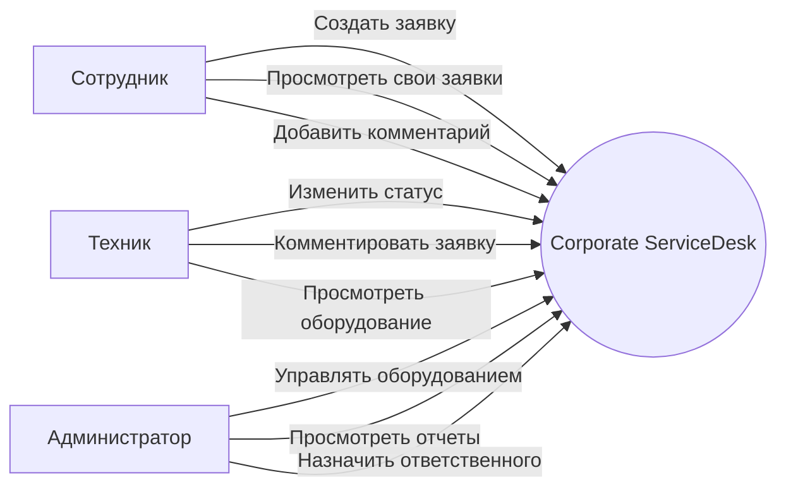
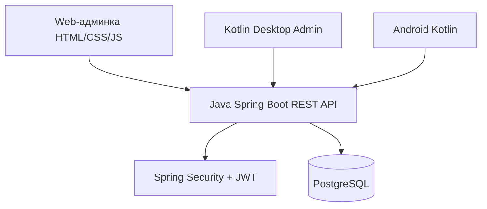
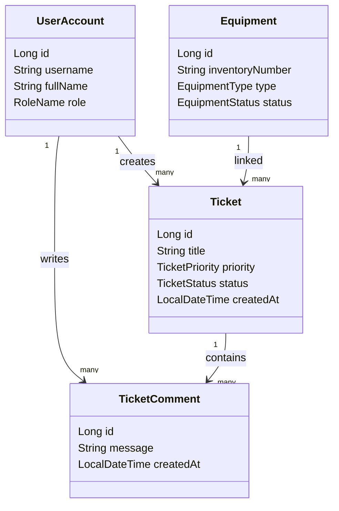
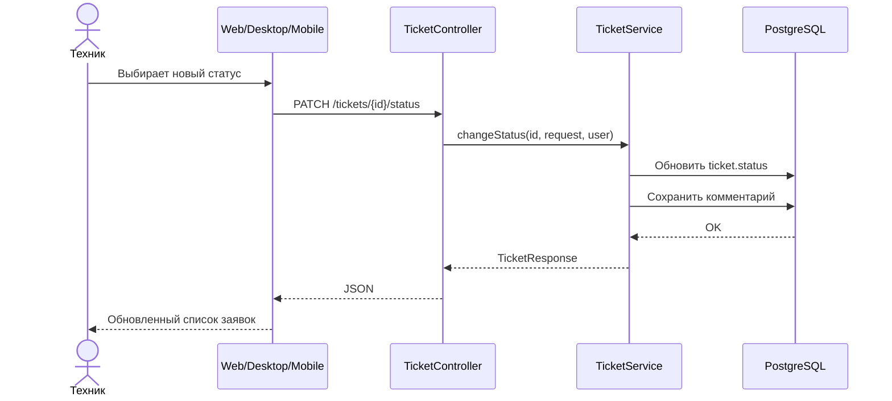

# UML-диаграммы

## Диаграмма вариантов использования

```mermaid
flowchart LR
    Employee[Сотрудник]
    Technician[Техник]
    Admin[Администратор]
    System((Corporate ServiceDesk))

    Employee -->|Создать заявку| System
    Employee -->|Просмотреть свои заявки| System
    Employee -->|Добавить комментарий| System
    Technician -->|Изменить статус| System
    Technician -->|Комментировать заявку| System
    Technician -->|Просмотреть оборудование| System
    Admin -->|Управлять оборудованием| System
    Admin -->|Просмотреть отчеты| System
    Admin -->|Назначить ответственного| System
```

## Компонентная диаграмма

```mermaid
flowchart TB
    Web[Web-админка HTML/CSS/JS]
    Desktop[Kotlin Desktop Admin]
    Mobile[Android Kotlin]
    API[Java Spring Boot REST API]
    Security[Spring Security + JWT]
    DB[(PostgreSQL)]

    Web --> API
    Desktop --> API
    Mobile --> API
    API --> Security
    API --> DB
```

## Диаграмма классов backend

```mermaid
classDiagram
    class UserAccount {
        Long id
        String username
        String fullName
        RoleName role
    }

    class Ticket {
        Long id
        String title
        TicketPriority priority
        TicketStatus status
        LocalDateTime createdAt
    }

    class Equipment {
        Long id
        String inventoryNumber
        EquipmentType type
        EquipmentStatus status
    }

    class TicketComment {
        Long id
        String message
        LocalDateTime createdAt
    }

    UserAccount "1" --> "many" Ticket : creates
    UserAccount "1" --> "many" TicketComment : writes
    Equipment "1" --> "many" Ticket : linked
    Ticket "1" --> "many" TicketComment : contains
```

## Последовательность смены статуса заявки

```mermaid
sequenceDiagram
    actor Technician as Техник
    participant UI as Web/Desktop/Mobile
    participant API as TicketController
    participant Service as TicketService
    participant DB as PostgreSQL

    Technician->>UI: Выбирает новый статус
    UI->>API: PATCH /tickets/{id}/status
    API->>Service: changeStatus(id, request, user)
    Service->>DB: Обновить ticket.status
    Service->>DB: Сохранить комментарий
    DB-->>Service: OK
    Service-->>API: TicketResponse
    API-->>UI: JSON
    UI-->>Technician: Обновленный список заявок
```

